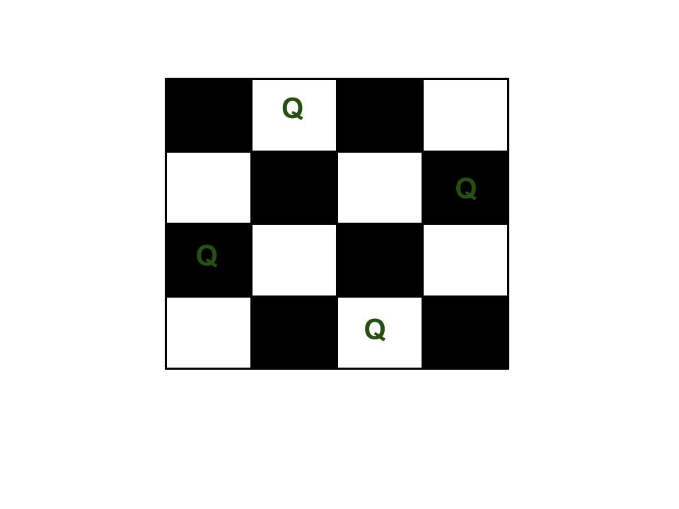

# NQUEEN
NQUEEN USING BACKTRACKING VERY SHORT CODE 
The N Queen is the problem of placing N chess queens on an N×N chessboard so that no two queens attack each other.  
For example, following is a solution for 4 Queen problem. 

The expected output is a grid ( using binary matrix) which has Q for the blocks where queens are placed and * elsewhere 
For example, following is the output matrix for above 4 queen solution.
ENTER THE DIMENSION OF THE CHESS BOARD: 4

Solution 1:
*  Q  *  * 
*  *  *  Q 
Q  *  *  * 
*  *  Q  * 

Solution 2:

 *  *  Q  *

 Q  *  *  *

 *  *  *  Q

 *  Q  *  *
